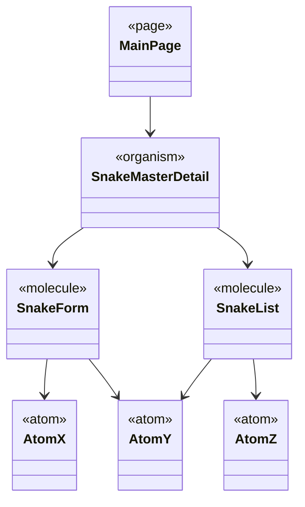
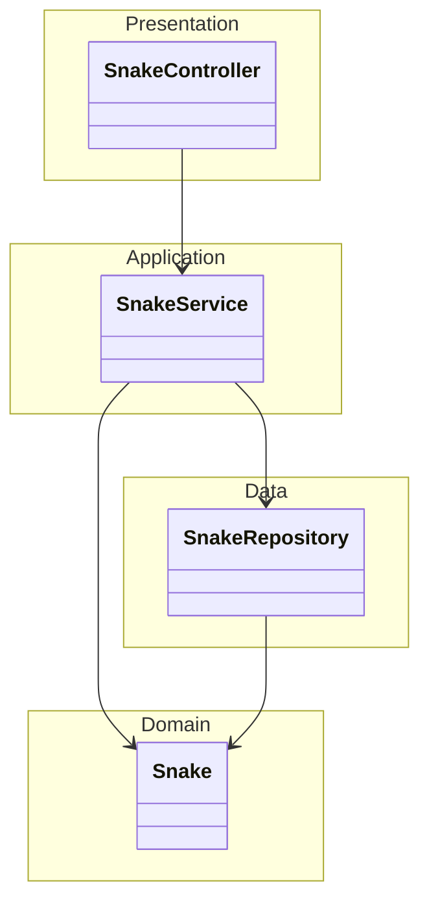

<<<<<<< HEAD
# My-Battlesnake
Battlesnake opdracht
=======
# Battlesnake

## Opdracht

Maak een applicatie om Battlesnakes (https://play.battlesnake.com) te beheren.

In de simpelste versie betekent dat:

* Je kunt slangen aanmaken/editen/verwijderen. De aanpasbare eigenschappen zijn in elk geval de kleur, hoofd en staart. 
* Naam is alleen in te stellen bij het aanmaken, en is onderdeel van de URL.

* Deze aangemaakte slangen kunnen worden gebruikt om een 'battle' te spelen.

* Complexere opties zijn:
  * Je kunt ook een bepaald algoritme kiezen voor een slang.
  * En die algoritmen hebben elk verschillende parameters.
  * Je kunt de gemaakte zetten inzien in een logboek.
  * (jouw idee hier)

## Frontend

We willen een nette 'master-detail' view om Snakes te beheren. Kortom, een lijstje van reeds bestaande slangen, en als je
er eentje aanklikt, dan kun je die slang editen. Verder is er een knop om een nieuwe slang aan te maken.



De exacte Atoms & Molecules zijn een beetje naar eigen inzicht. We willen er minstens een molecule zien voor "de lijst" 
en eentje voor "het edit formulier". Elke molecule maakt gebruik van minstens 2 atoms.

Vite proxy't requests op ```/api``` dus je maakt het jezelf een stuk makkelijk als je alle fetch requests relatief 
maakt op dat pad. (dus ```fetch('./api/eenofandereurl``)```, in plaats van ```fetch('http://localhost:8080/eenofandereurl')```).

## Backend

We willen een nette CRUD-REST API om (meerdere) Snakes te beheren.

* /api/snakes(/{id}): GET/POST/PUT/DELETE om slangen aan te maken, en hun eigenschappen te wijzigen
* Bij het opstarten een default slang aanmaken (zodat er altijd eentje is)
* De slang-configuraties worden netjes via JPA in een database opgeslagen (H2 is prima, Postgres is ietsje complexer, maar ook goed)
* We verwachten de eerder behandelde 4-laags architectuur, maar het is in dit geval te verdedigen om een _anemic domain model_ te maken



In de ```src/test/java``` staan een paar test-requests klaar die genoeg lijken op wat de Battlesnake servers naar je zouden sturen.

Vite proxy't alle requests op ```/api```, dus is het handig om alle @RequestMappings te starten met ```/api```.


## Deployment

Je kunt het geheel naar Azure deployen, bijv. Azure for Students ([https://azure.microsoft.com/en-us/free/students]()). Als
die op is kun je vast ook wel wat euros bietsen van je S3-groepje, want de site hoeft maar een paar dagen online te zijn.

Voor deze applicatie is het voldoende om H2 als database te gebruiken, dan raak je wel elke herstart je slangen kwijt, maar
dat is niet zo heel erg. En het maakt het deployen voor nu even een heel stuk simpeler.
(tip: je kunt H2 ook file-based gebruiken, op Azure blijft alles in je ```/home``` folder staan, dus ```/home/battlesnake.db``` 
zou bijv. werken)

In de build-plugins staat de Azure-Webapp plugin al klaar. Dus met
```mvn azure-webapp:config``` kun je een koppeling maken met je eigen webapp.

Het is aan te raden om van tevoren in Azure een ```Resource Group```, ```Web App``` (Java 21 SE) en ```App Service Plan``` (B1 of B2) aan te maken.
Als je dan de Config plugin draait dan zeg je 'n' tegen het maken van een nieuwe run-configuration, en krijg je een lijst om
uit te kiezen. (als je 'y' antwoordt dan maakt de tool een app in de USA aan, en da's een beetje traag).
De gegevens die toegevoegd worden aan je POM zijn veilig om in versiebeheer in te checken.

Uiteraard is het ook prima om op een kale VM te deployen.

Vite buildt de frontend in de resource-folder van de backend. Dus om het geheel tot 1 jar te maken moet je eerst ```npm run build``` uitvoeren. 
En daarna pas ```mvn package```.
>>>>>>> 626528b (Initial commit)
